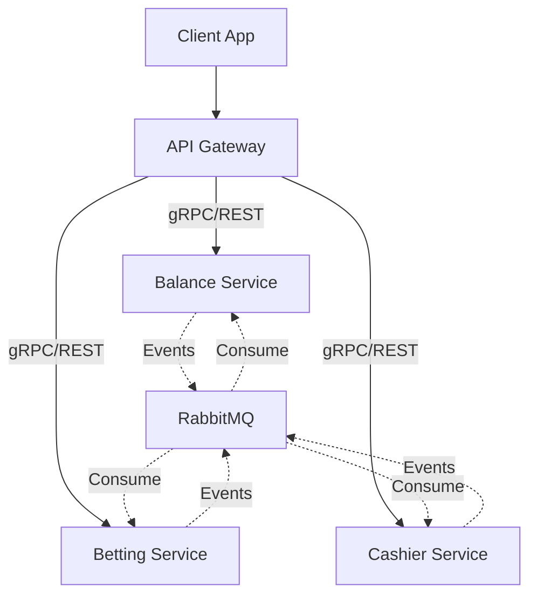

# Go Casino Microservices

An imaginary casino microservices system, built with different software architecture and technologies like **Golang**, **Clean Architecture**, and **Docker**. For communication between independent services, we use asynchronous messaging using **RabbitMQ**, and sometimes we use synchronous communication for real-time communications using **REST** and **gRPC**.

> 💡 This application is not business-oriented and my focus is mostly on the technical part. I just want to implement a sample using different technologies, software architecture design, principles.
>
> 🚀 This Application is in progress and I will add new features and technologies over time.

## Key Features

- **Microservices Architecture**
- **Clean Architecture (Domain, Service, Infrastructure Layers)**
- **Event-Driven Architecture with RabbitMQ**
- **gRPC and RESTful APIs**
- **Dockerized Environment**
- **Dependency Injection**

## Architecture Overview



## Software Architecture & Principles

The project follows strict **Clean Architecture** principles to separate business logic from implementation details.

- **Domain Layer**: Contains business domain interfaces and models. pure business logic.
- **Service Layer**: Implements business logic and use cases.
- **Infrastructure Layer**: Handles external dependencies like databases, RabbitMQ, and gRPC implementation.
- **Dependency Inversion**: Services depend on interfaces, not concrete implementations.
- **Separation of Concerns**: Each microservice handles a specific domain (Balance, Betting, Cashier).

## How to Run

To run the project locally, use Docker Compose:

```bash
docker-compose infra/development/docker/docker-compose.yaml up -d --build
```

### Services Ports

- **API Gateway**: `http://localhost:8081`
- **Cashier Service**: `9092`
- **Balance Service**: `9093`
- **Betting Service**: `9094`
- **RabbitMQ**: `5672`
- **RabbitMQ Management**: `15672` (User/Pass: `guest`/`guest`)
